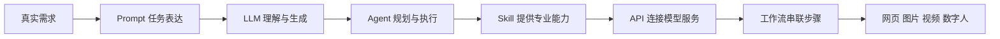

# 第 1 节：AI 到底能为普通人做什么

> 建议时长：8 分钟  
> 本节目标：先让学生看到结果，再让他们相信自己也能做到。

大家好，欢迎来到这套《普通人也能学会的 AIGC 实战入门》小课。我们这一节不急着讲一堆术语，也不急着区分各种模型名字。先把结论放在前面：AI 最有价值的地方，不是陪你聊天，而是帮你把一个真实想法，逐步变成一个能落地、能检查、能继续修改的作品。

如果你现在对 AI 还有一点陌生，这是很正常的。很多人第一次接触 AI，最常见的感觉就是“好像很厉害，但又不知道从哪里开始”。所以这一节，我们不从概念开始，而是从成果开始。你先看见结果，心里才会有方向。

现在请大家跟着画面看一圈。你会看到一个整理前后差别很大的课程素材文件夹，会看到一个孩子可以直接点击学习的英语互动网页，会看到一份可以继续编辑的 PPT，也会看到课程主视觉、短视频封面，以及后续还要补齐的数字人口播。表面上看，这些成果像是分散在不同的软件里；可它们背后，其实都可以用同一条逻辑串起来。

请大家先把这条链路记成一句很朴素的话：**人先提出真实需求，AI 再沿着一条清晰链路把它做出来。** 接下来的十节课，我们会一点点把这条链路拆开。你不需要在一开始就记住所有英文缩写，但你需要先知道，这整套课不是“工具大全”，而是一门把真实任务做出来的课程。

为了让这套课更有连续性，我们不会今天做海报、明天做表格、后天又突然跑去写一段毫无关联的视频文案。我们全程只围绕一个项目走，那就是：**制作一套“豆懂 AI 动物英语微课”**。这个项目听起来很轻，但里面几乎把 AIGC 入门最重要的能力都串起来了。

先有素材整理，说明 Agent 为什么能干活；再有 Prompt，说明人怎样把需求说清楚；接着生成互动网页和 PPT，说明 AI 不只是“会答题”，而是真的能辅助产出内容；然后我们再补上图片、视频、语音与数字人，最后把它们整合成一个能展示、能复用、能继续改造的小作品。

这一节，还有三个边界我希望大家一开始就知道。第一，AI 很强，但它并不等于永远正确。它会一本正经地说错话，所以结果一定要检查。第二，Agent 之所以能操作文件和软件，并不是因为它“神通广大”，而是因为产品给了工具，你又给了授权。第三，任何第三方工具的免费额度、模型价格和产品界面都可能变化，所以我们学的不是死记某个按钮，而是理解底层逻辑。

接下来，请你在心里想一个问题：如果今天就让你把 AI 用起来，你最希望它帮你完成什么？你可以想到自己最真实、最具体、最安全的那个任务。比如整理一个混乱的文件夹，做一页课程海报，写一段口播稿，帮孩子做一个英语练习页面，或者把一堆资料整理成一份清爽的 PPT。

这就是我们学 AI 最好的起点。不是从背定义开始，而是从一个真实任务开始。你只要先找到一个真实任务，后面的 Prompt、LLM、Agent、Skill、API，都有了意义。

### 屏幕演示建议

录制这一节时，可以按顺序展示三个画面。先展示成果总览，让学生“看见未来”；再展示主链路图，让学生“知道怎么走”；最后展示贯穿项目看板，让学生“知道这一整套课要做什么”。每个画面停留 5 到 8 秒，讲师口播以解释为主，不需要在这一节展开技术细节。

### 本节跟做

请学生用一句话写下自己最想让 AI 帮忙完成的一个任务。要求只有三个：事情要真实，风险要低，完成后能检查。课堂上可以随机请两三位同学说出来，然后讲师顺势点评：这类任务为什么适合拿来作为自己的第一个 AI 项目。

### 本节小结

这一节你只要带着一句话进入下一节就够了：**学习 AI，不是从背术语开始，而是从一个真实任务开始。** 下一节，我们先认识这条链路中最核心的“语言大脑”，也就是大语言模型 LLM。
