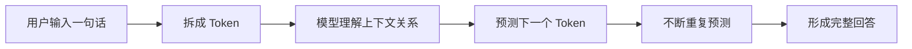

# 第 2 节：什么是大语言模型 LLM

> 建议时长：11 分钟  
> 本节目标：把 LLM 讲清楚，让学生知道它像什么、会什么、不会什么。

上一节我们已经知道，AI 真正有意义的地方，是帮助我们完成真实任务。那现在就会有一个非常自然的问题：既然 AI 这么会写、这么会说、这么会整理内容，它背后的“脑子”到底是什么？这就是我们今天要讲的大语言模型，也就是 LLM。

大语言模型这个词听起来有点“技术感”，但理解它不一定要从公式和参数开始。你可以先把它想象成一个读过很多资料、见过很多表达方式、也很会模仿和组织语言的“超级学霸”。它不是某一个 App，也不是某一个聊天窗口，而是一种底层模型能力。

为什么这个类比有用？因为它一下子能帮大家抓住重点。大语言模型很擅长读懂一段话的大意，也很擅长根据你的要求生成接下来的内容。比如让它总结一篇长文、把一段难懂的话说得通俗一点、给一个活动起标题、把中文翻成英文，或者把零散想法整理成一个更完整的框架，它往往都能做得不错。

不过这里有一个很重要的提醒：大语言模型虽然“像学霸”，但它不是“真理机器”。它能生成像样的内容，不等于它永远知道事实真相。尤其是当你的问题本身模糊、信息不足，或者涉及最新消息时，它可能会猜，甚至会一本正经地猜错。这一点一定要尽早形成习惯：**AI 给你的是高质量初稿，不是最终定稿。**

看到这里，很多同学会问：什么叫 Token？你可以把它理解成 AI 处理文字时用的一块块“语言积木”。人读文章，看的是字、词、句；AI 在底层处理的时候，会先把输入切成一个个小块，再根据这些小块之间的关系来计算“后面最可能出现什么”。

所以从底层逻辑看，大语言模型其实是在做一件事：根据前面的内容，预测后面的内容。但别小看这个“预测”。当模型见过足够多的语言模式之后，这种预测能力就会表现得非常像“理解”。于是它就能回答问题、续写内容、改写风格、归纳重点，甚至配合工具去完成更复杂的任务。

现在我们回到“普通人到底需要懂到什么程度”。其实你不需要理解矩阵乘法，也不需要会算参数量。你只要抓住三件事。第一，LLM 是底层模型，不等于具体的聊天软件。第二，LLM 特别擅长语言理解和内容生成。第三，LLM 不是永远正确，它需要清楚的输入，也需要人的检查。

为了帮助大家更稳地使用模型，我们把它的边界再说得更口语一点。需要它做“整理、改写、翻译、润色、起草”，它通常很靠谱；需要它做“拍板事实、代替专业审核、自动知道你没说出来的背景”，那就要小心。尤其在课程、证书、政策、医疗、法律、财务这类高风险场景里，任何重要信息都要二次核对。

### 屏幕演示建议

这一节的演示不需要切太多工具界面，可以重点展示三张图：超级学霸类比图、Token 积木图、能力边界对比图。讲师可以配合一个很短的现场示例，比如让 AI 用一句话解释“什么是碳中和”，然后再让它把解释改成“小学生也能听懂的版本”，让学生直观感受到 LLM 的语言转换能力。

### 本节跟做

请学生现场写一句话，让 AI 帮自己解释一个熟悉的概念，比如“什么是云盘”“什么是短视频脚本”“什么是二十四节气”。然后再追加一句：“请用小学生也能听懂的话重新解释一次。”通过这个练习，让学生感受到 LLM 最直接的价值，就是把信息变得更容易理解、更容易使用。

### 本节小结

请记住这一句：**大语言模型不是“真理机器”，而是“高水平语言生成机器”。** 只要你知道它最擅长什么，也知道它可能在哪些地方出错，你就已经比很多只会“随便问两句”的用户更会用 AI 了。下一节，我们就来讲一个最关键的使用能力：怎样把需求说清楚，也就是 Prompt。
