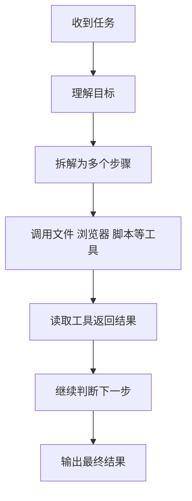

# 第 4 节：LLM 和 Agent 有什么区别

> 建议时长：11 分钟  
> 本节目标：把“会回答”和“会执行”讲透，让学生真正理解智能体。

到现在为止，我们已经知道，大语言模型擅长理解和生成语言，也知道 Prompt 是我们交给 AI 的任务说明书。那为什么有些 AI 只能聊天，有些 AI 却能读文件、改文档、整理资料，甚至一步步替你把事情做完？这背后差的，并不是“会不会说话”，而是“会不会执行”。

如果要用最口语的方式来讲，LLM 更像一位坐在你对面的顾问。你问它问题，它给你建议，帮你分析、整理、起草内容。Agent 则更像一位经过你授权的助理。它不仅会给建议，还会根据目标拆分步骤，调用工具，一步一步把任务推进下去。

这个差别看上去很小，但在实际使用里完全不是一个层级。比如你说“帮我整理这个文件夹”，如果只是普通的 LLM，它可能会告诉你应该怎样分类、怎样命名；但如果是具备工具能力的 Agent，它就可能在你的授权下先读取目录，再分析文件内容，再提出分类方案，最后真正生成文件清单、重命名建议，甚至执行整理。

所以，Agent 不是某个单独的模型名字，而是一种“模型加工具加流程”的工作方式。它的关键价值，就在于把“我有一个目标”变成“我知道接下来要做哪几步，而且我真的能动手去做”。

不过这里有一个特别重要的安全边界，必须反复提醒。Agent 不是天然拥有整台电脑的控制权。它能做什么，取决于三个条件：产品有没有提供对应工具，用户有没有明确授权，以及当前运行环境是否允许。也就是说，Agent 的能力并不神秘，它是建立在可见、可管、可限制的执行机制上的。

为了帮助大家更准确地区分，我们来做一个小判断。像“请帮我总结这段会议纪要”“请帮我把这段文字改得更口语化”，这类任务主要依赖 LLM 的语言能力；而“请读取这个文件夹里的资料并生成分类清单”“请根据这份资料制作一个五页 PPT”，就更接近 Agent 的执行型任务。两者并不对立，很多时候 Agent 的底层仍然要靠 LLM 来理解任务，只是它在上面又加了一层“行动力”。

为了让这个区分更落地，我们拿市面上几个大家熟悉的工具来对照一下。**ChatGPT**（OpenAI 出品）和 **Claude**（Anthropic 出品）这两个产品，核心定位更偏向 LLM——它们最强的能力是语言理解和生成，你问它问题、让它写东西，它表现非常出色；虽然现在也加了文件读取、联网、代码执行等工具能力，但产品的"骨架"仍然是对话式语言模型。而字节跳动推出的 **Coze（扣子）**，定位则明显偏向 Agent 编排——它一开始就是奔着"让普通人搭智能体"去的，你能在一个画布上把模型、插件、工作流、技能 Skill 串起来，让 AI 真的去执行多步骤任务，而不只是和你聊天。再比如国内常见的 Dify、FastGPT、Cherry Studio 这类工具，也都在 Agent / 工作流编排这一侧。所以下次你看到一个 AI 产品，可以先问自己一句：**它的强项是"会说"，还是"会做"？** 这往往就决定了它更偏 LLM，还是更偏 Agent。

### 屏幕演示建议

这一节可以用两个并排的小示例来录。左边示例让普通 LLM 说明“如果你要整理文件夹，建议怎样做”；右边示例则展示 Agent 的工作流程图，让学生看懂：前者给建议，后者走流程。即使这一节还不真正执行文件整理，也已经能为下一节的实操做好心理预备。

### 本节跟做

请学生拿出自己前面写过的真实任务，判断一下它更像“需要一个 LLM 帮我出内容”，还是“需要一个 Agent 帮我执行步骤”。如果是后者，再补充一句：这个任务需要哪些工具？比如文件、浏览器、表格、PPT、网页生成，还是图片与视频能力。

### 本节小结

这一节的关键句是：**LLM 主要负责理解与生成，Agent 在此基础上进一步负责规划、调用工具和执行任务。** 下一节我们再往前走一步，把 Agent 背后最像“技能包”和“插座”的两件事讲清楚，那就是 Skill 和 API。
