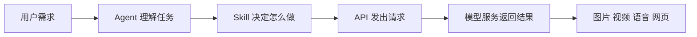

# 第 5 节：什么是 Skill 和 API

> 建议时长：12 分钟  
> 本节目标：帮助学生建立完整技术链路，不再把工具能力看成“魔法”。

学到这里，大家已经能看出一条比较清楚的线索了：人提出需求，用 Prompt 说清楚，LLM 帮忙理解和生成，Agent 负责规划和执行。那接下来还剩下两个经常被提到、但也最容易让初学者犯迷糊的词：Skill 和 API。别担心，这两个词并不复杂，只要找到一个合适的类比，它们会一下子变得很直观。

先说 Skill。你可以把 Skill 理解成一套“岗位技能包”，也可以把它理解成一份“标准作业流程”。它不是模型本身，而是告诉 Agent：遇到某一类任务时，应该怎么做，调用什么工具，传入哪些参数，怎样检查结果，遇到报错时又该怎样处理。


举个很接地气的例子。如果你让一个新人去做“生成图片”这件事，他可能知道目标，却不知道具体走哪套流程。Skill 的意义就在这里——它把流程、工具和规则都收进一个可复用的包里。这样 Agent 不必每次都从零摸索，而是可以按相对稳定的方法去完成任务。

再说 API。API 最容易理解的方式，就是把它看成“标准接口”或者“标准插座”。你家里插电器，不必关心墙后面所有复杂电路，只要插头和插座对得上，就能通电。软件世界也是一样。一个应用、一个 Skill，或者一个工作流，要想调用外部模型服务，就要通过标准化的 API 接口把请求发过去，再把结果拿回来。




现在，Skill 和 API 一旦连起来，整条链路就非常完整了。比如我们后面要用到的 Agnes 工作流，本质上就是把图片和视频生成能力通过 API 接进来，再通过可视化工作流界面让人更容易使用；而 Boson 这样的语音和数字人能力，也同样是通过对应 API 被调用，再由 Skill 或脚本封装成更适合 Agent 使用的形式。


这一节有一个特别值得学生建立的认知：当你真正理解 Skill 和 API 之后，你面对工具就不容易“神化”它们。你会知道，很多看似神奇的产品，其实都是在底层模型能力之上，做了更友好的封装、界面和流程组织。这样你以后看到新工具，也不会一下子被吓住，而是会问：它用了什么模型，靠什么接口，封装成了什么能力，适合什么任务。

为了让"调用"这件事不再停留在概念上，我们直接看一条真实的命令。课程里后面要用的 Agnes 生图能力，本质上就是通过 API 调起来的。它在我们这台电脑上被封装成了一个 Python 脚本，调用方式长这样（Windows 命令行）：

```bash
python %USERPROFILE%\.agents\skills\agnes-ai-generation-skill\scripts\agnes_api.py image ^
  --prompt "A cute orange cat and a small blue fish standing side by side, children book illustration, simple flat vector style, bright friendly colors, clean plain white background, centered composition, no text" ^
  --size 1024x1024
```

你看，这一条命令里其实就同时包含了我们这一节讲的三个东西：`agnes_api.py` 这个脚本本身，相当于一个封装好的 **Skill**（它知道"生成图片该走哪几步、传哪些参数"）；`image` 是它的子命令，告诉你这次要调的是"图片生成"这个能力；`--prompt` 和 `--size` 就是你传进去的参数；而它背后真正去请求的那个图片模型服务，靠的就是 **API**。你不用记命令细节，只要看懂这一层结构：**Skill 决定"怎么做"，参数决定"做成什么样"，API 负责"把请求送到模型那里再拿结果回来"**。这条命令在第 8 节课后任务里会原样用到，到时你会亲手跑一次。

再补一句：很多人第一次看到这种命令会紧张，觉得"是不是要先学编程"。其实不用。今天大多数 Agent 平台（比如前面提到的 Coze、Dify，还有我们后面会用的 Agnes Workbench）都已经把这种命令做成了可视化界面——你只要在画布上拖节点、填框框，平台会自动帮你拼出类似的调用。会看命令，是为了你以后遇到问题能"看得懂、能 debug"；但日常使用，根本不用手敲。

### 屏幕演示建议

这一节不建议让学生一开始就看大量接口文档，而是通过三张图来理解。先用 Skill 技能包图建立直觉，再用 API 插座图解释“连接能力”的概念，最后用完整链路图收束。若要加一个现场示例，建议只口头举例：比如“用户说要一张宣传图，Agent 通过 Skill 调用图片 API，模型生成结果，再回到工作流中预览”。

### 本节跟做

请学生试着用一句自己的话解释 Skill 和 API。只要能说成“Skill 是做事方法包，API 是连接外部能力的接口”，基本上就已经讲清楚了。你也可以顺手让学生把自己的真实任务想一想：如果这个任务要用到图片、视频或语音能力，背后大概率就会经过某种 API。

### 本节小结

这一节我们真正搭起了课程的底层骨架：**Agent 是会执行的协作体，Skill 是它的专业技能包，API 是它连接外部模型能力的标准接口。** 下一节，我们就开始进入更落地的实操场景，用一个很典型的文件整理案例，看看 Agent 是怎样真正“干活”的。
