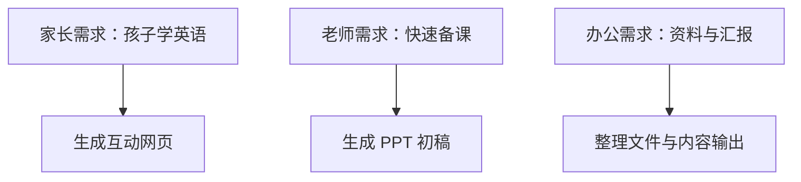

# 第 7 节：不同人群怎样使用 Agent

> 建议时长：12 分钟  
> 本节目标：让学生把 AI 和自己的真实身份联系起来，而不是停留在“别人能用”。

很多课程一讲 AI，就容易给人一种距离感，仿佛只有程序员或者年轻的互联网从业者才用得上。其实不是。真正有价值的 AI 应用，往往恰恰发生在很普通、很真实的场景里。只要你有要处理的信息、有重复工作、有需要表达的内容，AI 基本就能帮上忙。

先说家长。很多家长最头疼的，不一定是“不会学”，而是没有时间把学习内容做得更适合孩子。这个时候，Agent 非常适合帮忙做一个轻量的互动学习资源。比如我们这门课的贯穿项目，就是一个“动物英语微课”。如果家长想让孩子学五个动物单词，Agent 就可以帮忙整理出单词、中文释义、例句，再把它们做成一个单文件网页，甚至带有发音和选择题。

再说老师。老师的典型痛点，是资料很多、备课时间有限、还要兼顾版式与表达。这个时候，Agent 既可以先帮助老师整理原始材料，也可以基于已有资料生成一套 PPT 初稿。这里要提醒学生，AI 生成的 PPT 不是“拿来就一定能讲”，但它非常适合作为第一版雏形。教师真正需要做的，是把控学情、逻辑和课堂节奏，而这些恰恰是 AI 不能代替的。

最后说办公人员。办公室里最常见的重复任务，就是整理资料、提炼重点、改写表达、做汇报、处理表格、准备会议材料。Agent 的优势，是它能在多个小步骤之间连续工作。它可以先读资料，再整理结构，再给出初稿，甚至还能根据反馈继续修改。对于很多日常杂活来说，这种“帮你走完前 70%”的能力，已经足以节省大量时间。

除了这三类典型人群，AI 在更广的行业场景里也已经悄悄落地。这里再快速点几个真实方向，帮大家把视野打开——细节我们放到实践案例里去练。

**政务场景**：办事大厅每天都会接到大量群众咨询，很多问题其实是重复的。工作人员可以把一段时间内的咨询记录交给 AI，让它整理出高频问题清单，再为每类问题生成一条标准答复模板。这样前台答复更统一，新人上手也更快，不用每件事都靠老员工口口相传。

**店铺经营**：开小店的人，常常一个人既要管货又要管宣传。AI 可以帮你给一批商品批量生成介绍文案，也可以把乱糟糟的库存表整理成"商品 / 数量 / 待补货"的清晰表格。一个人也能干出一个小团队的活，重点是把"要表达的内容"和"要整理的数据"分别交给 AI 处理。

**内容创作**：做自媒体的人，最耗时的往往不是写，而是选题和起稿。AI 可以帮你基于近期热点先列一版选题，再针对选中的题目生成一份脚本初稿。你真正要做的是把控观点、节奏和个人风格——这部分 AI 给不了，但它能帮你把"从零到第一稿"的时间压缩一大半。

这三个方向的共同点是：**AI 接手的都是重复性强、门槛不高、却很占时间的环节，把人解放出来去做判断和决策。** 不管你身处哪个行业，只要工作里有"重复处理信息"的部分，就值得试一试能不能交给 AI。

这一节的关键，不是让学生记住三类人群，而是帮学生完成一个心理转变：不要总想“AI 对别人有什么用”，而要开始想“AI 对我现在最真实的一件事能有什么用”。一旦这个转变出现，学生就更容易主动去尝试，而不是停留在围观状态。

### 屏幕演示建议

这一节可以采用“一个主演示，两个结果展示”的方式。主演示建议放在互动网页，因为它最直观、最容易让学生有成就感；PPT 和办公整理可以用成果截图加简短说明。这样能兼顾节奏，也不会因为工具切换过多而分散注意力。

### 本节跟做

请学生根据自己的身份，从家长、老师、办公人员这三个角度中选一个最接近自己的场景，用一句话说出他最想让 Agent 帮忙完成的一个任务。然后，再试着补一句：这个任务完成之后，什么样的结果算是“可用”的？这个步骤非常重要，因为它会帮助学生形成“结果可检查”的意识。

### 本节小结

这一节希望大家记住：**AI 的价值不在于炫技，而在于把它嵌进自己的真实场景。** 下一节我们会开始接触多模态生成，也就是怎样把文字进一步变成图片和视频。
