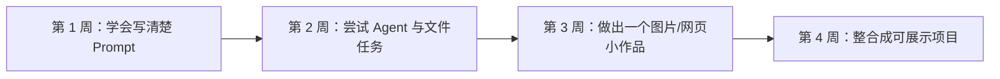

# 第 10 节：AI 趋势、学习路径和后续课程

> 建议时长：13 分钟  
> 本节目标：帮助学生建立后续行动路径，同时用克制、自然的方式完成课程转化。

走到这里，大家已经跟着整套课程跑完了一条非常完整的入门链路。你已经知道大语言模型是什么，知道 Prompt 怎样写，也知道 LLM、Agent、Skill 和 API 之间的关系，还看见了文件整理、互动网页、PPT、图片、视频和数字人口播怎样串成一个完整项目。接下来最后一节，我们不再讲新术语，而是回答三个更现实的问题：为什么现在值得学 AI？普通人应该怎样继续学？如果想更系统一些，下一步又可以怎么走？

先说为什么现在值得学。原因其实并不神秘。以前会用电脑，意味着会打字、会 Word、会简单做表格；而今天，“会用 AI”正在逐渐变成一种新的基础能力。它不是替代人的全部工作，而是在大量信息处理、内容起草、方案生成、表达优化、重复任务整理这些环节上，显著提高效率。无论你是家长、老师、办公人员，还是想做内容和副业的人，这件事都已经越来越贴近现实。

接着说怎么继续学。很多人一提到学习 AI，就会以为自己要先学编程、学算法，甚至学很复杂的技术框架。对于大多数初学者来说，这反而会把门槛抬得太高。更稳妥的路径，是先从真实任务出发，学会把任务说清楚，学会判断结果对不对，学会组合工具，再慢慢往更复杂的工作流走。

为了让学生更容易行动，我们把后续路径设计成两条并行路线。第一条是免费自主学习路线，适合愿意自己慢慢摸索的人。你可以继续用课程里的模板、工作流和案例，不断尝试自己的任务，把一个个真实问题做出来。第二条是系统课程学习路线，适合希望有人带着走、希望有完整体系、练习反馈和持续答疑的人。两条路线没有高低之分，关键是看你更适合哪一种节奏。

如果你好奇这套课和这条学习路径"为什么是这样设计"的，这里简单说一下背后的逻辑。整套课的顺序是**理论 → 实操 → 整合**，这不是随便排的，而是符合技能学习里一条被反复验证的经验：**先建立心智模型，再上手做最小动作，最后做综合项目。** 所以第 1 到第 5 节先让你听懂 LLM、Prompt、Agent、Skill、API 这些概念，是为了你动手时心里有底，不至于瞎试；第 6 节立刻进入文件整理这个最安全、最容易成功的实操，是为了让你尽早拿到一次"我做到了"的成功体验，这种早期成功体验对坚持学习非常关键；第 7 到第 9 节再把图片、视频、语音、数字人、网页整合进同一个项目，是因为"在真实项目里串起来用"比"孤立练某个工具"记得牢得多；最后第 10 节回到趋势和路径，是为了让你学完不迷茫，知道下一步往哪走。简单说，**这条路径的每一步，都是"先让你懂、再让你做、最后让你整合和延续"。**

这里我特别想强调，AI 学习不应该建立在焦虑上。我们不需要用“你不学就会被淘汰”这种话去吓人。更合理的表达是：如果你愿意尽早开始，你会更早获得新的表达能力、组织能力和生产效率；如果你暂时还没准备好，也至少应该先建立最基本的认知，避免在未来被工具变化拉开差距。

### 屏幕演示建议

最后一节适合以三张图收尾：AI 影响场景图帮助学生回到现实；30 天学习路线图帮助学生获得行动感；双路径学习图则帮助课程自然过渡到课后学习安排。这里不需要“硬推销”，而是把选择权交给学生。你可以告诉他们，课程中涉及的部分工具、模板和思路，本身就是可以继续拿去练习的；如果想进一步系统化，也欢迎课后咨询学校助教老师。

### 本节跟做

请学生在课末写下一个“30 天内我愿意完成的 AI 小目标”。这个目标可以很轻，比如做一个可打开的互动网页、把一个混乱文件夹整理清楚、做一份像样的教学 PPT，或者完成一张主视觉和一条短视频。只要目标具体、能检查、能在一个月内做完，它就很适合作为自己的第一个 AI 学习成果。

### 本节小结

整套课到这里，我们真正希望你带走的不是十个定义，而是一种新的行动方式：**从真实任务出发，把需求说清楚，借助模型和智能体逐步把作品做出来。** 这就是普通人学习 AI 最踏实、也最有成就感的一条路。

### 写在最后：往哪走，我们接着陪你

课程到这就讲完了，但你的 AIGC 之路才刚开始。如果你今天听完，心里已经有了那个"想用 AI 做出来"的真实任务，但又觉得一个人摸索还是有点慌，下面这几件事你可以挑一个马上做：

1. **扫码进群**——课程画面右侧的二维码就是我们的学员交流群。群里每天都会有助教值班答疑，你跑命令报错了、Prompt 写不出想要的效果、不知道某个工具该不该选，都可以直接甩到群里，我们和往期同学一起帮你看。一个人走得快，一群人才走得远。
2. **关注公众号"豆懂AI"**——我们会持续更新 AIGC 实战内容：新工具上手测评、Prompt 模板库、真实项目复盘、国产替代方案对比。新课早鸟价、内测名额、直播答疑这些福利，也都会第一时间在公众号发布。
3. **领取进阶资料包**——进群后回复"资料包"三个字，助教会发你一份不断更新的资源合集，里面包括：这套课的完整 Prompt 模板、文件整理 Agent 的可复用口令、图片生成的统一风格前缀、数字人 + 互动网页的整合模板，以及一份"30 天 AI 入门打卡表"。这些资料光看没用，必须配上你自己的真实任务才生效——所以领完之后，记得真的跑一遍。

我们不承诺你学完就能"月入过万"，也不会用"再不学就晚了"吓你。我们能承诺的是：只要你愿意把那个真实任务交出来，我们就有办法陪你把它做出来。**群里见。**
