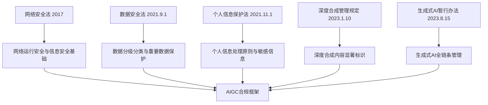

# 附录 A：AIGC 合规与法规

> 本附录定位：权威背书层。把"用 AI"这件看似轻松的事，放回法律与政策的坐标系里。
> 适用对象：政企培训学员、企业合规与信息化负责人、对 AIGC 监管感兴趣的普通用户。
> 阅读时间：约 15 分钟。

---

## 一、引言：为什么普通人也要懂一点 AIGC 法规

很多人第一次用 AIGC，最直接的感受是"好用、神奇、停不下来"。但只要稍微多走几步，比如把一份客户名单喂给 AI 让它整理、把公司内部代码贴进去让它排错、或者用 AI 换脸做一段搞笑视频，问题就来了：这样做合法吗？出了事谁负责？

中国并不是没有规则。恰恰相反，从 2017 年的《网络安全法》开始，国家已经围绕"网络、数据、个人信息、算法、生成式 AI、深度合成"织出了一张层次分明的监管网。这张网的核心思路只有一句话：**既要发展，也要安全；既要创新，也要负责。**

本附录不打算把所有条文背一遍，而是把和普通人、企业最相关的几部法规拎出来，讲清楚三件事：哪部法管什么事、关键义务是什么、落到日常使用上你应该怎么做。所有法规名称、施行日期和核心条款主旨，均依据国家网信办（cac.gov.cn）等官方渠道公开原文核实，不杜撰条文号。

---

## 二、核心法规速览：五部法规撑起的合规框架

AIGC 不是"法外之地"。围绕它的监管可以分成两层：一层是基础性的"数据三法"，另一层是专门针对算法和生成式 AI 的部门规章。下面这五部（类）法规，是最常被引用的合规依据。

### （一）《生成式人工智能服务管理暂行办法》：AIGC 的"基本法"

这是目前中国层级最高、专门针对生成式 AI 的部门规章，由**国家网信办、国家发改委、教育部、科技部、工信部、公安部、广电总局**七部门联合公布，**2023 年 8 月 15 日施行**（据 [国家网信办官方全文](https://www.cac.gov.cn/2023-07/13/c_1690898327029107.htm)、[七部门联合公布消息](http://www.cac.gov.cn/2023-07/13/c_1690898326795531.htm)）。

它的核心制度可以浓缩成五个关键词：

- **算法备案**：具有舆论属性或社会动员能力的生成式 AI 服务，须按《互联网信息服务深度合成管理规定》履行算法备案程序，并按规定开展安全评估。截至 2026 年初，国家网信办已分多批发布生成式 AI 服务备案信息（据 [网信办备案公告](https://www.cac.gov.cn/2024-04/02/c_1713729983803145.htm) 等）。
- **训练数据合法**：使用预训练、优化训练数据，应当使用"具有合法来源的数据和基础模型"，不得侵害他人知识产权，涉及个人信息的要取得同意。
- **内容审核**：服务提供者承担生成内容的"网络信息内容生产者"责任，履行个人信息保护义务。
- **用户实名**：要求用户提供真实身份信息。
- **生成内容标识**：应当按照《互联网信息服务深度合成管理规定》对 AI 生成的图片、视频等内容进行标识。

这部办法的"暂行"二字很关键：它意味着规则还在迭代。普通人不需要背条文，但要记住一个判断标准——**凡是面向公众提供服务、具有舆论属性的生成式 AI，都要走备案和标识这一套**。

### （二）《数据安全法》：数据分级分类是第一道关

《中华人民共和国数据安全法》自 **2021 年 9 月 1 日施行**。它最重要的制度是**数据分类分级保护**：国家建立数据分类分级保护制度，根据数据的重要程度以及一旦泄露造成的危害程度，对数据实行分类分级保护；各地区、各部门确定本地区、本部门重要数据具体目录，对列入目录的数据重点保护（据 [《数据安全法》全文](https://www.nra.gov.cn/xxgk/gkml/ztjg/gfzd/fl/202209/t20220905_338153.shtml)、[第二十一条解读](https://www.secrss.com/articles/54529)）。

对企业和个人而言，最直接的义务有两个：一是**重要数据出境要做安全评估**；二是开展数据处理活动要建立健全全流程数据安全管理制度。配套的国家标准《数据安全技术 数据分类分级规则》（GB/T 43697-2024）给出了具体操作指引（据 [全国信安标委文件](https://www.tc260.org.cn/upload/2024-03-21/1711023239820042113.pdf)）。

### （三）《个人信息保护法》：处理个人信息必须有合法依据

《中华人民共和国个人信息保护法》自 **2021 年 11 月 1 日施行**（据 [国家网信办全文](https://www.cac.gov.cn/2021-08/20/c_1631050028355286.htm)）。它确立了处理个人信息的几条铁律：

- **合法、正当、必要和诚信原则**，采取对个人权益影响最小的方式。
- **告知同意**：处理个人信息前，应当以显著方式、清晰易懂的语言真实、准确、完整地告知处理者名称、联系方式、处理目的、方式、种类、保存期限、个人行使权利的方式和程序；取得个人的同意，同意应当在充分知情的前提下自愿、明确作出。
- **敏感个人信息更严格**：处理生物识别、宗教信仰、特定身份、医疗健康、金融账户、行踪轨迹等信息，以及不满十四周岁未成年人信息，只有在具有特定目的和充分必要性、并采取严格保护措施的情形下方可处理，且须取得**单独同意**。

把这条规定放回 AIGC 场景，结论很朴素：**凡是包含他人身份证号、手机号、病历、人脸等敏感信息的素材，不要直接喂给公网 AIGC 工具。**

### （四）《互联网信息服务深度合成管理规定》：AI 换脸换声的"紧箍咒"

这是中国首部深度合成领域的专门法规，由网信办、工信部、公安部联合发布，**2023 年 1 月 10 日施行**（据 [网信办官方全文](https://www.cac.gov.cn/2022-12/11/c_1672221949318230.htm)、[公安部全文](https://www.mps.gov.cn/n6557558/c8797736/content.html)）。

它最重要的义务是**显著标识**：深度合成服务提供者对使用其服务生成或编辑的信息内容，应当采取技术措施添加不影响用户使用的**标识**；提供智能对话、合成人声、人脸生成、沉浸式拟真场景等服务的，应当进行显著标识，使公众能够识别该内容为深度合成技术生成。同时，具有舆论属性或社会动员能力的深度合成服务提供者须进行**算法备案**。

> 重要提示：该规定还明确，深度合成服务提供者和使用者**不得利用深度合成服务制作、复制、发布、传播虚假新闻信息**。这意味着用 AI 生成"假新闻"不只是道德问题，更是违法行为。

### （五）《网络安全法》：地基之上的地基

《中华人民共和国网络安全法》自 **2017 年 6 月 1 日施行**，是上述所有规章的上位法依据。《生成式人工智能服务管理暂行办法》第一条就开宗明义：根据《网络安全法》《数据安全法》《个人信息保护法》等法律制定。

它对普通人最相关的两点是：一是**网络运营者收集使用个人信息应当遵循合法、正当、必要的原则**，公开收集使用规则，明示目的方式和范围，并取得被收集者同意；二是任何个人和组织不得从事非法侵入他人网络、干扰他人网络正常功能、窃取网络数据等危害网络安全的活动。

---

## 三、五部法规对照表：一眼看清谁管什么

| 法规名称 | 施行日期 | 主管部门 | 核心制度主旨 |
|---------|---------|---------|-------------|
| 《网络安全法》 | 2017.6.1 | 国家网信办等 | 网络运行安全、信息安全、个人信息收集基本规则 |
| 《数据安全法》 | 2021.9.1 | 国家网信办、各行业主管部门 | 数据分级分类、重要数据保护、出境安全评估 |
| 《个人信息保护法》 | 2021.11.1 | 国家网信办 | 告知同意、最小必要、敏感个人信息单独同意 |
| 《深度合成管理规定》 | 2023.1.10 | 网信办、工信部、公安部 | 深度合成内容显著标识、算法备案 |
| 《生成式 AI 暂行办法》 | 2023.8.15 | 网信办等七部门 | 算法备案、训练数据合法、内容审核、实名、标识 |

> 说明：以上日期与主管部门均依据官方原文核实。具体条款的适用与解释，以官方公布版本为准。

---

## 四、实践指引：普通人/企业使用 AIGC 的合规清单

法规读起来抽象，落地却非常具体。下面这份清单把五部法规的要求，拆解成普通人和企业都能照做的操作项。建议在每次使用 AIGC 前，对照打勾。

### 个人用户清单

- [ ] **不输入敏感个人信息**：他人的身份证号、手机号、银行卡号、病历、人脸照片等，脱敏后再使用，或干脆不输入。
- [ ] **不输入商业秘密与未公开信息**：公司源代码、客户名单、未公开财务数据，不要直接贴给公网 AIGC 工具。
- [ ] **使用前看一眼服务协议**：确认该工具是否声明会用你的输入做训练，是否有数据保留期限。
- [ ] **AI 生成内容要标注**：在对外发布 AI 生成的图片、视频、文章时，主动注明"AI 辅助生成"或按平台要求打标识。
- [ ] **不传播 AI 生成的虚假信息**：尤其是涉及时政、突发事件、公共人物的"新闻"，发布前核实信源。
- [ ] **核实信息真伪**：AI 给出的法规条文号、日期、数据，使用前用权威渠道二次核对（这一条很重要，AI 幻觉会编出看起来很像真的条文号）。

### 企业与机构清单

- [ ] **建立 AIGC 使用制度**：明确哪些岗位可以用、可以用到什么程度、用什么工具，签署员工使用规范。
- [ ] **优先选择已备案模型**：面向公众提供服务时，核实所使用的生成式 AI 是否已完成网信办备案，并在显著位置公示备案信息。
- [ ] **数据分级分类后再决定能否上 AI**：按《数据安全法》和国家标准 GB/T 43697-2024 对数据分级，重要数据和敏感个人信息不得直接输入公网 AIGC。
- [ ] **涉密或核心业务走私有化部署**：对数据安全要求高的场景（政务内网、金融核心、医疗影像等），选择私有化部署或开源模型本地部署。
- [ ] **生成内容纳入内容审核流程**：AI 生成的对外内容，须经人工复核与平台既有审核流程，不能"AI 写完直接发"。
- [ ] **履行算法备案与标识义务**：自研或对外提供生成式 AI 服务的，按规定履行算法备案和安全评估；对生成的图片、视频、音频按规定进行显著标识。
- [ ] **数据出境先评估**：涉及重要数据出境、或大规模个人信息出境的，按《数据出境安全评估办法》申报评估，或按《个人信息出境标准合同办法》签订标准合同。

---

## 五、本附录小结

合规不是"限制创新"，而是"让创新可持续"。把这一附录读完，你至少应该建立三层认知：

第一层，中国 AIGC 监管已经形成"网络安全法—数据安全法—个人信息保护法—深度合成规定—生成式 AI 办法"的完整链条，五部法规各管一段，共同构成合规框架。

第二层，普通人最容易踩的坑，不是"违法"，而是"无知"——把客户名单喂给公网 AI、把 AI 编造的法规号写进正式文件、传播 AI 生成的假新闻，这些都是在不知情中触碰红线。

第三层，合规的本质是一种"前置思考"：在动手用 AI 之前，先问一句"这个数据能进 AI 吗？这个结果能信吗？这个内容能发吗？"。把这三个问题养成习惯，比背任何条文都管用。

---

## 六、实践思考题

1. **场景判断题**：你是一家小型培训机构的市场专员，老板让你把去年 500 名学员的报名表（含姓名、手机号、身份证号、付费记录）整理成 Excel 后，发给一个免费在线 AI 工具让它"帮我分析学员画像"。请对照本附录的五部法规，指出至少三处合规风险，并给出合规的替代做法。

2. **标识义务题**：你用某 AI 工具生成了一段数字人口播视频，准备发到公司公众号和视频号宣传课程。请说明根据《深度合成管理规定》和《生成式 AI 暂行办法》，你应当履行哪些标识义务？如果该 AI 工具尚未在网信办备案，还能继续用于对外发布吗？

3. **选择与反思题**：在"完全合规但效率一般"和"踩着红线但效率很高"之间，企业决策者应当如何取舍？请结合本附录提到的"算法备案、数据分级分类、生成内容标识"三项制度，写出你的判断依据。

---

> **数据来源声明**：本附录所引法规名称、施行日期、主管部门及核心制度主旨，均依据国家网信办（cac.gov.cn）、公安部（mps.gov.cn）等官方渠道公开原文核实（核实时间 2026 年 7 月）。具体条款的适用与解释，以官方公布版本为准。法规体系会持续演进，建议定期回溯官方渠道获取最新动态。
