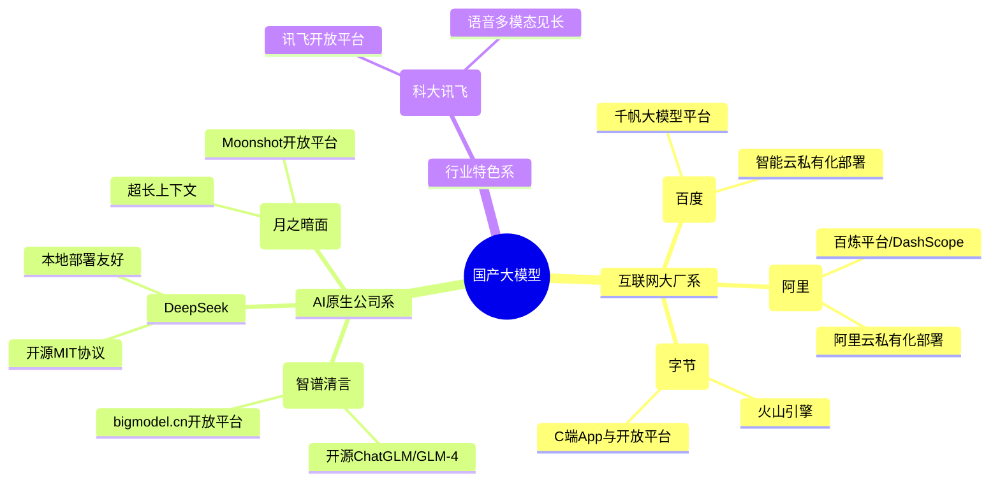

# 附录 C：国产化与自主可控

> 本附录定位：帮你在国产大模型的"百模大战"里建立一张清晰地图。
> 适用对象：政企信息化与合规负责人、教育科研用户、对国产 AI 感兴趣的普通用户。
> 阅读时间：约 15 分钟。
> 信息截止：**2026 年 7 月**（大模型迭代极快，本附录只描述公开功能特性，不做能力打分）。

---

## 一、引言：为什么"国产化"是一张必答题

在 AIGC 浪潮里，"用谁的模型"从来不只是技术问题，更是合规与安全问题。对一个普通用户，选哪个 AI 助手可能只是体验偏好；但对一个政府机关、一家国企、一所学校、一家医院来说，选哪个模型，意味着：**你的数据流到哪里、受谁的法律管辖、出问题找谁负责。**

这也是为什么"国产化与自主可控"在 2024 年 DeepSeek 爆发之后，迅速从政策口号变成实操清单。本附录要做的，是把国产大模型的版图画清楚，把数据出境的合规红线点出来，再按场景给你一份选型建议。需要特别说明：**本附录只描述各模型的公开功能特性、入口与部署方式，不对其能力做无法溯源的打分排名**——能力评测因任务、版本、测试集而异，任何绝对排名都需要可复现的证据支撑。

---

## 二、国产大模型概览（截至 2026 年 7 月）

国产大模型数量已超百款，这里只列出面向公众和企业用户、具备代表性、公开信息可查的几款。每款只描述其公开功能特性、官方入口与部署方式。

### （一）文心一言（百度）

- **C 端入口**：文心一言网页版与 App（yiyan.baidu.com）。
- **功能特性**：支持文本对话、写作、绘图、文档解析等通用生成式 AI 能力。
- **企业版/私有化部署**：通过**百度智能云千帆大模型平台**提供企业级 API 与私有化部署方案，面向政企客户提供模型精调、推理服务与企业级安全（据 [文心一言入口](https://yiyan.baidu.com/)、公开报道）。
- **适合场景**：日常办公、内容创作、企业客服与知识管理。

### （二）通义千问（阿里）

- **C 端入口**：通义千问网页版与 App（tongyi.aliyun.com）。
- **功能特性**：支持文本、代码、长文档解析、图像理解等多模态能力；在数据处理（如 Pandas/Excel 脚本）、Web 开发类任务上有公开报道提及的优势（据 [新浪科技横评](https://k.sina.cn/article_7879923012_1d5ae154401903gv66.html)）。
- **企业版/私有化部署**：通过**阿里云百炼平台 / DashScope** 提供 API 与企业级部署，支持在阿里云上做私有化或专有云部署。
- **适合场景**：日常办公、数据分析、企业应用集成、政企上云。

### （三）智谱 GLM / 智谱清言（智谱 AI）

- **C 端入口**：智谱清言 App 与网页版；开放平台 bigmodel.cn。
- **功能特性**：智谱是中国首家在港完成 IPO 的大语言模型公司（据 [芯谋研究排行榜](https://www.icviews.cn/semiCommunity/postDetail/15577)），GLM 系列支持文本、代码、多模态、Agent 等能力。
- **开源版本**：智谱在 GitHub（组织账号 zai-org）持续开源 ChatGLM-6B、ChatGLM2-6B、ChatGLM3、GLM-4-9B 等模型权重。其中 GLM-4-9B-Chat 支持 128K 上下文长度（据 [ModelScope 模型卡](https://modelscope.cn/models/ZhipuAI/glm-4-9b-chat/summary)、[GitHub GLM-4](https://github.com/zai-org/GLM-4)）。
- **开源协议注意**：智谱开源模型使用自定义的 GLM-4 / ChatGLM License，**商业用途通常需要额外申请授权**，使用前务必阅读对应仓库的 LICENSE 文件，不要假定它与 MIT 等宽松协议等同。
- **适合场景**：教育科研（开源版可本地研究）、企业知识管理、技术开发。

### （四）DeepSeek（深度求索）

- **C 端入口**：DeepSeek 官方 App 与网页版；开放平台 api.deepseek.com。
- **功能特性**：以开源与高性价比著称，DeepSeek-R1 在数学、代码、自然语言推理等任务上有公开报道的对标能力（据 [DeepSeek-R1 发布公告](https://api-docs.deepseek.com/zh-cn/news/news250120/)）。
- **开源策略**：DeepSeek-V3 和 DeepSeek-R1 的模型权重统一采用 **MIT License**，**不限制商用，无需申请**，并明确允许使用 R1 进行模型蒸馏（据 [DeepSeek-R1 发布公告](https://api-docs.deepseek.com/zh-cn/news/news250120/)）。这是国产大模型中开源协议最宽松的代表之一。
- **本地部署**：可通过 **Ollama** 等工具本地部署蒸馏版本（1.5B/7B/8B/14B/32B/70B），蒸馏小版本对硬件要求较低；完整版 671B 需多卡集群（据 [腾讯云部署文档](https://cloud.tencent.com/document/product/851/115962)、[知乎部署指南](https://zhuanlan.zhihu.com/p/20642808493)）。已有腾讯云、阿里云等十余家云厂商接入。
- **适合场景**：技术开发、本地化研究、政务/企业内网私有化部署、教育科研。

### （五）Kimi（月之暗面）

- **C 端入口**：Kimi 智能助手 App 与网页版（kimi.com）；开放平台 platform.kimi.com。
- **功能特性**：以**超长上下文**为标志性能力。**2024 年 3 月**，月之暗面宣布 Kimi 无损上下文长度从 20 万字提升至 **200 万字**（据 [腾讯云开发者社区](https://cloud.tencent.com/developer/article/2407798)、[智源社区](https://hub.baai.ac.cn/view/35888)、[月之暗面官网](https://www.moonshot.cn/)）。一次可处理长篇文档、整本书籍、大量文件。
- **企业版**：通过 **Moonshot 开放平台**提供 API；私有化部署公开信息较少，需联系厂商。
- **适合场景**：长文档阅读与总结、研究报告、法律文书分析、学术文献处理。

### （六）豆包（字节跳动）

- **C 端入口**：豆包 App 与网页版。
- **功能特性**：通用对话、写作、语音、图像生成等能力；公开报道提及豆包大模型日均调用量增长迅速（据 [网易转载排行榜](https://www.163.com/dy/article/KQL8EVL805566T0A.html)）。
- **企业版/私有化部署**：通过**火山引擎**提供企业级 API 与部署方案。
- **适合场景**：日常办公、内容创作、C 端应用集成。

### （七）讯飞星火（科大讯飞）

- **C 端入口**：讯飞星火 App 与网页版（xinghuo.xfyun.cn）。
- **功能特性**：在**语音多模态**（语音识别、语音合成、多语种）方面见长，结合文本、代码、数学等通用能力。
- **企业版/私有化部署**：通过**讯飞开放平台**提供 API 与行业解决方案，教育、医疗等垂直行业方案较完整。
- **适合场景**：教育（尤其 K12 与语言学习）、客服中心、语音交互场景。

> **重要说明**：本节"适合场景"是基于各模型公开特性与厂商重点行业的归纳，**不构成绝对能力排名**。具体选型应以你自己的实际任务做小范围测试为准，且大模型能力随版本快速迭代，今天的结论未必适用于明天。

---

## 三、数据出境合规：国产化的另一层意义

"国产化"之所以重要，很大一部分原因在于**数据出境合规**。如果你的业务数据通过境外模型处理，就涉及跨境传输，要遵守中国的数据出境监管。两份核心规定如下。

### （一）《数据出境安全评估办法》

- **实施日期**：**2022 年 9 月 1 日**（据 [网信办官网](https://www.cac.gov.cn/2022-07/07/c_1658811536396503.htm)）。
- **核心要求**：数据处理者向境外提供数据，属于下列情形之一的，应当申报数据出境安全评估：
  - 关键信息基础设施运营者收集和产生的个人信息和重要数据出境；
  - 处理 100 万人以上个人信息的数据处理者出境个人信息；
  - 累计出境个人信息达到规定数量；
  - 重要数据出境。
- **重要数据特别规定**：据网信办 2025 年 10 月发布的 [数据出境安全管理政策问答](https://www.cac.gov.cn/2025-10/31/c_1763633376984070.htm)，数据处理者被告知掌握重要数据或数据被公开发布为重要数据后，如需继续开展数据出境活动，应当在被告知或公开发布后 **2 个月内**申报数据出境安全评估。

### （二）《个人信息出境标准合同办法》

- **实施日期**：**2023 年 6 月 1 日**（据 [网信办官网](https://www.cac.gov.cn/2023-02/24/c_1678884830036813.htm)）。
- **核心要求**：未触发数据出境安全评估条件的个人信息出境活动，可通过与境外接收方**签订标准合同**（并完成备案）的方式合规出境。这是除"安全评估"和"个人信息保护认证"之外的第三条合规路径。

> 对绝大多数普通用户和中小企业的实操结论是：**凡是涉及重要数据、大规模个人信息、或政务/金融/医疗核心数据的，优先选择国产大模型或私有化部署，避免数据出境风险。** 这正是"国产化"在合规层面的根本意义。

---

## 四、国产化部署方式：三种路径的区别

把模型"用起来"，从部署方式上可以分成三类，成本、安全、灵活度依次不同。

| 部署方式 | 数据是否出本地 | 成本 | 灵活度 | 适合场景 |
|---------|--------------|------|--------|---------|
| **公有云 API** | 出本地（但通常不出境） | 低，按量计费 | 低，依赖厂商能力 | 日常办公、C 端应用、个人使用 |
| **私有化部署（厂商专有云/私有云）** | 不出企业 | 中高，含授权与硬件 | 中，可精调 | 政企内网、金融核心、医疗影像 |
| **开源模型本地部署** | 完全不出本机 | 硬件成本为主，软件可免费 | 高，可自由改造 | 教育科研、政务内网、对自主可控要求高的场景 |

具体说明：

- **公有云 API**：调用国产模型的官方 API（如 DeepSeek、通义千问、文心一言的开放平台）。优点是上手快、成本低；缺点是数据要发送到厂商服务器。选择这条路径时，应确认厂商的服务器在中国境内，并阅读其数据处理与留存条款。
- **私有化部署**：厂商把模型部署到客户自有的私有云或专有云上（如百度智能云、阿里云、火山引擎的企业方案）。数据不离开企业边界，安全性和可控性高，适合政务、金融、医疗等对数据安全要求高的场景。
- **开源模型本地部署**：下载开源模型权重（如 DeepSeek MIT 版、智谱 GLM-4 开源版）到本地服务器运行，数据完全不出本机，自主可控度最高。适合教育科研、政务内网、有技术团队的企业。需注意硬件门槛（完整大模型需多卡 GPU）和开源协议（如智谱 GLM 商用需申请授权）。

---

## 五、选型建议：按场景，不按排名

不同场景对模型的需求完全不同。下面这份建议按"场景"组织，而不是按"谁更强"。

### 场景一：日常办公与内容创作

- **优先**：公有云 API 的国产模型（通义千问、文心一言、豆包、Kimi、DeepSeek）。
- **理由**：上手快、成本低、能力足够，不涉及敏感数据。
- **注意**：客户名单、合同条款、内部财务等敏感信息仍需脱敏或走私有化部署。

### 场景二：政企内网与核心业务

- **优先**：私有化部署的国产模型，或开源模型本地部署（如 DeepSeek MIT 版、智谱 GLM-4 开源版）。
- **理由**：数据不出内网，满足《数据安全法》《数据出境安全评估办法》对重要数据和政务数据的要求。
- **注意**：所选对外提供服务的生成式 AI 须已完成网信办算法备案，按《生成式 AI 暂行办法》履行标识义务。

### 场景三：教育科研

- **优先**：开源模型本地部署（DeepSeek、智谱 GLM-4 开源版），便于研究和教学。
- **理由**：可深入模型内部、可微调、可复现，适合教学与论文研究。
- **注意**：使用开源模型时严格遵守其 LICENSE（DeepSeek 为 MIT 宽松协议；智谱 GLM 商用需申请授权）。

### 场景四：长文档与深度阅读

- **优先**：Kimi（200 万字无损上下文）或支持长上下文的国产模型。
- **理由**：长文档、整本书籍、大批量文献处理是 Kimi 的标志性场景。
- **注意**：涉及敏感文档（如未公开论文、内部研究报告）时，应走私有化部署或脱敏后再用。

### 场景五：语音交互与教育

- **优先**：讯飞星火等语音能力突出的模型。
- **理由**：语音识别、语音合成、多语种是讯飞的传统强项，适合语言学习、客服中心。

---

## 六、实践指引：政企场景的国产化选型清单

如果你是政企信息化或合规负责人，下面这份清单可以指导你完成一次国产化选型。

- [ ] **第一步：数据分级分类**。按《数据安全法》和 GB/T 43697-2024 把业务数据分级，明确哪些是重要数据、哪些是敏感个人信息、哪些是公开数据。
- [ ] **第二步：判断是否涉数据出境**。如果业务数据可能通过境外模型处理，评估是否触发《数据出境安全评估办法》或需签《个人信息出境标准合同》。
- [ ] **第三步：确定部署方式**。核心业务（政务、金融、医疗）选私有化部署或开源本地部署；一般办公选公有云 API。
- [ ] **第四步：核实模型备案状态**。面向公众提供服务的生成式 AI，核实是否在网信办完成备案（可查网信办公告）。
- [ ] **第五步：核查开源协议**。如使用开源模型本地部署，逐字阅读 LICENSE（DeepSeek = MIT；智谱 GLM = 自定义协议，商用需授权）。
- [ ] **第六步：评估硬件成本**。私有化或本地部署需评估 GPU 资源，完整大模型（如 671B）需多卡集群，蒸馏版对小团队更友好。
- [ ] **第七步：小范围试点**。选定 1-2 个模型，用真实业务数据（脱敏后）做小范围测试，不要一次铺开。
- [ ] **第八步：建立持续跟踪机制**。大模型迭代极快，选型不是一次性决策，应每季度回溯各模型版本与备案状态。

---

## 七、本附录小结

国产化与自主可控，不是一句口号，而是一套从"选模型"到"管数据"的完整方法论。读完这一附录，你至少应该带走三个判断。

第一，**国产大模型已经形成完整生态**。从互联网大厂（文心、通义、豆包）到 AI 原生公司（智谱、DeepSeek、Kimi）到行业特色（讯飞），公有云 API、私有化部署、开源本地部署三条路径都成熟可用。

第二，**数据出境合规是国产化的根本驱动**。《数据出境安全评估办法》《个人信息出境标准合同办法》把"数据能不能出去"这件事写得很清楚，对政务、金融、医疗等核心场景，国产化不是选择题，而是必答题。

第三，**选型应按场景，不按绝对排名**。日常办公、政企内网、教育科研、长文档、语音交互，各有最适合的模型；任何脱离具体任务的"谁更强"结论，都需要可复现的证据，本附录不做无法溯源的能力打分。

---

## 八、实践思考题

1. **场景选型题**：你是一家三甲医院的信息中心主任，需要在院内上线一个 AI 辅助病历整理系统，供医生把口语化查房记录整理成结构化病历。请说明：(1) 你会优先选择公有云 API、私有化部署、还是开源模型本地部署？为什么；(2) 在选型时，你需要核实候选模型的哪些合规资质（备案、协议、数据出境）？

2. **开源协议题**：你的研发团队打算基于开源模型做一个对外商用的 AI 客服产品，候选有 DeepSeek-R1（MIT 协议）和智谱 GLM-4-9B（GLM-4 自定义协议）。请说明这两种协议在商用上的核心差异，以及你的团队应当分别做什么动作才能合规商用。

3. **数据出境判断题**：某创业公司为了省钱，直接调用某境外厂商的大模型 API 处理用户上传的简历（含姓名、手机号、求职意向）。请结合本附录和附录 A 的法规，指出这个做法存在哪些合规风险，并给出两条合规的替代方案。

---

> **数据来源声明**：本附录各模型的入口、功能特性、开源协议均依据其官网、开放平台、GitHub 仓库与公开报道核实（核实时间 2026 年 7 月）。"日均调用量增长""上下文长度""IPO 状态"等事实，均标注来源；本附录不对各模型做无法溯源的能力打分。开源协议条款以各仓库 LICENSE 文件最新版本为准，商用前请务必阅读原文并必要时联系厂商。大模型能力与产品形态迭代极快，建议定期回溯官方渠道获取最新动态。
