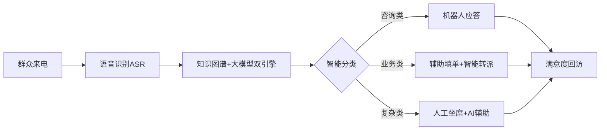
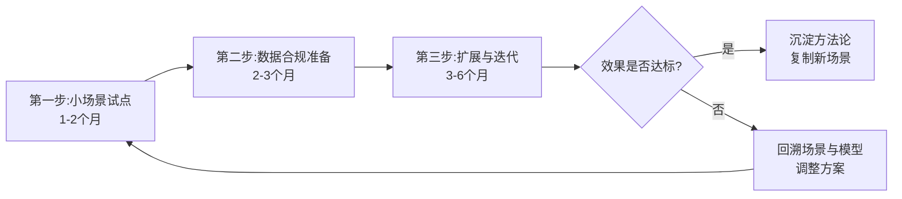

# 附录 D：行业落地实证

> 本附录定位：用公开案例证明"AIGC 不是 PPT，是已经在干活的生产力"。
> 适用对象：想在自己行业落地 AIGC、但又拿不准从哪下手的企业与机构负责人。
> 阅读时间：约 15 分钟。
> 信息截止：**2026 年 7 月**。案例均据公开报道或政府/机构官方渠道，数据无法溯源处明确标注"需核实"。

---

## 一、引言：从"能不能用"到"怎么落地"

前三篇附录分别讲了合规、安全、国产化。这一篇要回答的是另一个问题：**AIGC 在真实行业里到底用得怎么样了？**

答案是：**已经用起来了，而且不止一个行业。** 从政务 12345 热线到高校 AI 助教，从制造业的 AI 质检到医院里的影像辅助诊断，AIGC 正在从" Demo 演示"走向"日常生产力"。但需要清醒的是：**落地不是一蹴而就的魔法**，每一个成功案例背后，都是数据准备、流程改造、合规评估、人员培训的长期工程。

本附录会按"政务、教育、医疗、制造、金融"五个主要行业，各给出有据可查的公开案例，每个案例都标注场景、使用的 AI 能力类型、效果与来源。对那些效果数据无法在公开渠道完整核实的，我会明确标"需核实"，绝不凑数。最后给出一份"企业如何起步 AIGC 落地的 3 步法"。

---

## 二、政务：从"AI 政务助手"到 12345 热线升级

政务是国产大模型落地最早、公开案例最丰富的领域之一。2025 年春节期间 DeepSeek 的爆发，被视为政务领域国产大模型大规模部署的重要契机。

### 案例一：深圳"深小i"AI 政务助手

- **场景**：在"i深圳"APP 上线试运行的 AI 政务助手"深小i"，提供全市域、全领域、全智能的政策解答和办事引导。
- **使用的 AI 能力**：自然语言大模型 + 政策知识库，面向企业和群众解决政策咨询问题。
- **效果**：据深圳市政府门户网站，一次解答**精准率近 90%**（据 [深圳市政府门户网站](https://www.sz.gov.cn/cn/xxgk/zfxxgj/zwdt/content/post_12014444.html)）。
- **说明**：该"近 90%"为政府官方发布数据，具体测试口径与样本量未在公开报道中完整披露，**作为参考性指标，精确数据需核实官方原始统计**。

### 案例二：北京经开区"亦智"政务大模型平台

- **场景**：北京市首个政务大模型服务平台，率先落地经开区，统一为政务服务、市场监管、城市治理提供模型纳管、数据训练等共性服务。
- **使用的 AI 能力**：大模型服务平台，承载智慧政务小助手、迎商中心数字人、智能决策助手、亦城慧眼、实验室智能监管等 8 个应用场景。
- **效果**：作为全市首个集约化政务大模型平台落地（据 [北京经开区报道](https://www.nda.gov.cn/sjj/ywpd/szsh/1231/20241231164508306623129_pc.html)、[办事公告](http://banshi.beijing.gov.cn/tzgg/202407/t20240702_428169.html)）。具体效率提升数据公开报道未完整披露，**需核实**。
- **趋势补充**：北京市 2025 年 12 月发布《全面深化"一网通办"推进政务服务数智化发展行动计划（2026-2027 年）》征求意见稿，提出制定政务领域 AI 大模型应用建设管理办法和模型选型指引（据 [新浪财经](https://finance.sina.com.cn/tech/roll/2025-12-01/doc-infzhtse3089393.shtml)）。

### 案例三：12345 热线的"超级话务员"

- **场景**：广州、广西、辽宁阜新等多地 12345 政务服务便民热线接入大模型，打造智能应答、辅助填单、智能分类与转派。
- **使用的 AI 能力**：普遍采用"**知识图谱 + 大模型**"双引擎架构；广州政务系统接入 DeepSeek 等大模型（据 [广州市政府门户](https://www.gz.gov.cn/szgzkfgx/zdgz/content/post_10153907.html)）；广西在 DeepSeek R1 模型基础上自定义参数（据 [广西国资委](http://www.sasac.gov.cn/n2588025/n2588129/c32908534/content.html)）。
- **效果**：
  - 广西："DeepSeek+12345"模式，群众**满意度 99% 以上**，入选优秀案例 20 余项（据 [广西国资委](http://www.sasac.gov.cn/n2588025/n2588129/c32908534/content.html)）。
  - 辽宁阜新：处理效率**提升 25%**（据 [阜新市政府](https://www.fuxin.gov.cn/content/2026/1074194.html)）。
- **说明**：上述满意度与效率数据均为地方官方发布，作为公开案例的参考性指标。

---

## 三、教育：从高校 AI 助教到中小学 AI 素养

教育是 AIGC 落地最具想象空间、也最需要审慎的领域。

### 案例一：北京大学"基于大语言模型的 AI 助教"

- **场景**：北京大学董彬教授团队开发的 AI 助教"BB"，已在北大课程中使用。
- **使用的 AI 能力**：基于大语言模型的一对一辅导、答疑、教学支持。
- **来源**：北大新闻网报道"AI 助教赋能智慧教育"主题分享（据 [北大新闻网](https://news.pku.edu.cn/xwzh/beac8d5838cc4234bb25499cc67c0d54.htm)）。北大教务部还面向部属高校征集首批"人工智能+高等教育"典型应用场景案例，核心方向之一即为**智能助教**（据 [北大教务部通知](https://provost.pku.edu.cn/tzgg/8775cf6debe1434fb5cf9fb5c71a2eb2.htm)）。
- **说明**：具体使用规模与效果数据公开报道未完整披露，**需核实**。

### 案例二：中小学 AI 通识教育与素养框架

- **场景**：国家层面推进中小学人工智能通识教育。
- **使用的 AI 能力**：以 AI 素养教育为核心，而非单纯工具使用。
- **进展**：
  - 北大召开"中小学人工智能通识教育"创新研讨会，教育部、北京市相关领导及教育界专家参与（据 [北大新闻网](https://news.pku.edu.cn/xwzh/b6e5f36522ba4ba4bfd1dd4bebd3027e.htm)）。
  - 北京师范大学发布《中小学人工智能教育课程方案与实施建议》，确立计算思维、人机协同、伦理判断等核心素养（据 [北师大方案 PDF](https://aiedu.bnu.edu.cn/docs/2025-07/6ddbce1ce4b64a4884372af4c0d3ecc7.pdf)）。
- **研究数据**：麦可思《2025 年高校师生 AI 应用及素养研究》显示，57.9% 受访教师将"跨学科创新能力"、56.9% 将"学术伦理"视为 AI 素养核心要素（据 [高等教育月度动态 PDF](https://fzghc.sdca.edu.cn/__local/9/5E/36/E96D086B0E67E9F10D1AE75CF37_85137F9B_1A1C3DF.pdf)）。

---

## 四、医疗：辅助而非替代，谨慎是底线

医疗行业的 AIGC 应用必须放在一个铁律之下理解：**AI 是辅助，不是替代；医生是决策者，AI 是工具。**

### 案例一：AI 医学影像辅助诊断（已获三类医疗器械注册）

- **场景**：心血管疾病、肺结节、乳腺疾病、眼底病变、骨折识别等领域的 AI 影像辅助诊断。
- **使用的 AI 能力**：计算机视觉 + 医学影像分析，主要功能是"提示疑似病灶"，**不做出最终诊断**。
- **关键合规前提**：AI 影像辅助诊断软件须获得国家药监局（NMPA）**第三类医疗器械注册证**方可临床使用（据 [安全内参](https://www.secrss.com/articles/77205)、[健康派](http://www.djkpai.com/ai/176658.html)）。三类医疗器械是 NMPA 风险等级最高的分类，注册门槛严格。
- **代表性企业**：数坤科技在国内拥有 14 张 NMPA 三类医疗器械注册证，覆盖冠脉 CTA、头颈 CTA、肺动脉 CTA、主动脉 CTA 等多个影像领域（据 [医药出海通](https://chinamedglobal.com/blog/china-ai-medical-device-overseas-case-studies)）；推想科技、德适科技等也有产品获证。
- **谨慎表述**：本附录**不引用**任何"AI 诊断准确率超过医生"之类的未核实说法。AI 影像产品的价值在于"提示疑似病灶、减轻医生阅读负担"，最终诊断始终由持证医生作出。

### 案例二：医院管理与服务优化

- **场景**：智能导诊、智能随访、病历结构化、医院运营管理等非诊断类场景。
- **使用的 AI 能力**：大语言模型的文本理解与生成能力。
- **来源**：中国医院协会信息专委会（CHIMA）公开案例集展示多个"防、筛、诊、治、管、康"一体化闭环管理案例（据 [CHIMA 案例](https://www.chima.org.cn/Html/News/Columns/34/Index0.html)）。
- **说明**：具体医院名称与效果数据公开报道较分散，**部分细节需核实原始案例文档**。

> **医疗落地的重要提醒**：任何对外宣称"AI 替代医生诊断"的产品或宣传，都应保持高度警惕。中国法律框架下，AI 影像辅助诊断产品必须以"辅助"定位获批三类医疗器械证，且最终诊断责任由医生承担。

---

## 五、制造：从质检到研发，AI 进入核心生产环节

制造业是 AIGC 与传统产业融合最深的领域之一。工信部等八部门的"人工智能+制造"专项行动计划提出，到 2027 年推动 3-5 个通用大模型在制造业深度应用（据公开报道）。

### 案例一：制造业 AI 全流程应用

- **场景**：研发设计、生产制造、质量检测、仓储物流全流程。
- **使用的 AI 能力**：大模型 + 智能体（Agent）平台，结合行业垂直模型。
- **代表性实践**：
  - 据 **信通院《2025 年度制造业数字化转型典型案例集》**，吉利汽车、诺力智能、德马科技等龙头企业设立 AI 研究院，重点突破 AI 在研发设计、生产制造、质量检测、仓储物流等全流程的融合应用（据 [信通院案例集 PDF](http://www.caict.ac.cn/xwdt/ynxw/202509/P020250926514825863116.pdf)）。
  - 和利时工业智能体 AIXMagital 全面接入 DeepSeek 大模型，面向煤化工行业进行场景设计与优化，通过传感器实时表征气化炉温度（据 [制造业场景人工智能应用分类分级蓝皮书 2025](https://www.secrss.com/articles/77205)）。
- **说明**：龙头企业的具体效率提升数据需查阅原始案例集，本附录未引用未经核实的具体百分比。

### 案例二：AI 辅助研发与代码

- **场景**：智能辅助驾驶方案研发、工业软件代码生成与优化。
- **使用的 AI 能力**：大模型 + Agent 平台，降低研发门槛。
- **来源**：《2025 CCF 企业数字化发展推荐案例集》收录的"AI 大模型+智能 Agent 平台"案例（据公开报道）。

---

## 六、金融：智能客服与风控的双重落地

金融行业是大模型中标项目最密集的行业之一。据公开报告，2024 年 Q1 至 2025 年 Q2，金融业大模型相关中标项目共计 191 个（据 [2025 金融业大模型应用报告]，**具体统计口径需核实原始报告**）。

### 案例一：银行智能客服

- **场景**：客服坐席全流程辅助、智能问答、数字客服。
- **使用的 AI 能力**：大模型 + 小模型 + RPA 的组合方案。
- **代表性实践**：
  - **光大银行**"智能知识辅助助手"，采用"大模型+小模型+RPA"方案，贯穿客服坐席全流程（据 [沙丘智库《22 家银行大模型应用实战》](https://www.shaqiu.cn)，**具体来源链接需核实**）。
  - **兴业银行**构建智能体平台，上架超 200 个智能体，部署全渠道 AI 数字客服，覆盖理财、个贷、信用卡等十余个场景（据 [2025 年银行业人工智能十大典型应用案例](http://www.financeun.com/newsDetail/6284)，**具体案例细节需核实原文**）。

### 案例二：智能风控

- **场景**：实时监测市场行情与交易记录，识别欺诈风险与信用隐患。
- **使用的 AI 能力**：深度学习 + 大模型。
- **代表性实践**：厦门银行构建智能体实时监测市场行情与交易记录（据 [2025 金融智能体重构风控报告]，**需核实原文**）；浦发银行"AI 信贷风控平台"、招商银行"智能客户画像系统"（据 [2025 年银行智能风控报告](https://www.finebi.com)，**具体数据需核实**）。
- **谨慎表述**：部分公开报道提及"坏账率下降 10%"等具体数字，本附录**未直接引用**这些未经原始报告核实的百分比，仅作方向性说明。

> **金融落地的重要提醒**：金融风控涉及资金安全与监管合规，AI 只能作为辅助决策工具，最终信贷、风控决策由持牌机构按监管要求作出。

---

## 七、其他行业掠影

除上述五大行业外，AIGC 在更多领域也有公开实践。

- **文旅**："如如"文旅大模型等面向景区服务、行程规划的政务/行业大模型应用（据 [多案例研究](https://www.smartcity.team/)，**具体细节需核实原文**）。
- **基层治理**：上海浦东数字人"小浦"、社工 AI 助手"小鲸"等面向基层社工辅助的应用（据 [多案例研究](https://www.smartcity.team/)，**具体细节需核实原文**）。
- **医药研发**：云南白药与华为合作的"雷公大模型"，辅助中医药知识问答与研发数据治理（据 [公开报道]，**项目细节需核实**）。

---

## 八、各行业落地一览表

| 行业 | 典型场景 | 使用的 AI 能力 | 代表案例 | 效果/状态 |
|------|---------|--------------|---------|----------|
| 政务 | 政策咨询、办事引导 | 大模型+知识库 | 深圳"深小i" | 一次解答精准率近 90%（官方数据） |
| 政务 | 12345 热线 | 知识图谱+大模型双引擎 | 广西"DeepSeek+12345" | 满意度 99%+；阜新效率提升 25% |
| 教育 | 高校 AI 助教 | 大语言模型 | 北大 AI 助教 BB | 已落地课程，规模数据需核实 |
| 教育 | 中小学 AI 素养 | AI 素养教育 | 北师大课程方案 | 国家层面推进，框架已成型 |
| 医疗 | 影像辅助诊断 | 计算机视觉 | 数坤科技等（14 张三类证） | 须三类医疗器械证，辅助非替代 |
| 医疗 | 医院管理 | 大语言模型 | CHIMA 案例集 | 智能导诊、随访、病历结构化 |
| 制造 | 全流程 AI | 大模型+Agent | 吉利、诺力、德马 | 信通院案例集收录 |
| 制造 | 工业智能体 | 大模型+IoT | 和利时+DeepSeek | 煤化工场景落地 |
| 金融 | 智能客服 | 大模型+小模型+RPA | 光大、兴业银行 | 200+智能体上架（兴业） |
| 金融 | 智能风控 | 深度学习+大模型 | 浦发、招商、厦门银行 | 辅助决策，具体数据需核实 |

> 表中所有数据均标注来源；标注"需核实"的，指该数据在公开报道中未完整披露或未在原始报告中找到精确口径，本附录未做编造。

---

## 九、实践指引：企业如何起步 AIGC 落地的 3 步法

看完这些案例，如果你所在企业或机构也想开始 AIGC 落地，建议按下面三步走，切忌"一步到位"。

### 第一步：找准一个"小而真"的场景试点（1-2 个月）

- **选场景的标准**：业务真实、数据现成、风险可控、效果可量化。
- **好场景举例**：客服知识库问答、内部文档检索与总结、报表自动生成、营销文案初稿。
- **避免的场景**：直接对接核心生产或高风险决策（如信贷审批、医疗诊断、生产控制）——这些要等专业团队和合规评估到位后再做。
- **目标**：跑通一个完整闭环，让团队建立"AI 能干什么、不能干什么"的真实体感。

### 第二步：完成数据与合规准备（2-3 个月）

- **数据准备**：把试点场景所需的数据梳理出来，按《数据安全法》分级分类，敏感数据脱敏或走私有化部署。
- **合规评估**：核实所选模型是否完成网信办备案；评估是否涉及数据出境；准备用户告知与同意机制（如涉及个人信息）。
- **制度准备**：建立 AIGC 使用规范、生成内容审核流程、事件应急响应机制。
- **目标**：让试点场景从"能跑"变成"能合规地跑"。

### 第三步：小范围扩展与持续迭代（3-6 个月）

- **扩展方式**：从试点场景向相邻场景延伸（如客服→售后→营销）。
- **效果度量**：用业务指标（响应时间、人力节省、满意度、错误率）而非"AI 调用次数"来衡量价值。
- **持续迭代**：大模型能力与产品迭代极快，每季度回溯模型版本、备案状态、效果指标，保持动态调整。
- **目标**：把"一个试点"沉淀为"一套方法论"，让后续场景能复制经验。

---

## 十、本附录小结

行业落地实证这一附录，想传达的核心有三句话。

第一，**AIGC 已经在真实行业里干活了**。政务 12345 热线用 DeepSeek 当"超级话务员"，医院用 AI 影像辅助阅片，制造业龙头把大模型接进生产全流程，银行的智能客服覆盖几十个场景。这不是 PPT，是公开可查的实践。

第二，**每个成功案例背后都是系统工程**。数据准备、合规评估、流程改造、人员培训，缺一不可。没有一个案例是"买了模型就立刻见效"的。

第三，**落地要从小处着手、从合规筑底**。3 步法的精髓不是"快"，而是"稳"——先跑通一个小场景，再补齐数据与合规，最后才扩展。这比一上来就铺大摊子，成功率高得多。

读完这一附录，如果你能带着"我所在的行业/部门，哪个场景适合做第一个试点"这个问题离开，本附录的目的就达到了。

---

## 十一、实践思考题

1. **场景筛选题**：你是一家区域性连锁零售企业的 CIO，公司想开始 AIGC 落地。候选场景有三个：(A) 客服中心常见问题自动应答；(B) 门店补货量预测与自动下单；(C) 用 AI 生成促销短视频。请用本附录的"小而真"标准（业务真实、数据现成、风险可控、效果可量化），评估这三个场景哪一个最适合作为第一个试点，并说明理由。

2. **合规边界题**：你是一家互联网医院的技术负责人，打算上线一个"AI 辅助诊断"功能，让患者上传症状描述后 AI 给出"可能疾病建议"。请结合本附录的医疗案例和附录 A 的法规，说明：(1) 这个功能在法律上属于哪类产品，需要什么资质；(2) 为什么本附录反复强调"AI 是辅助，不是替代"。

3. **效果度量题**：你的公司在客服中心上线了 AI 助手三个月，老板问"效果怎么样"。请列出至少四个你应当采集和汇报的业务指标（不能只看"AI 调用次数"），并说明每个指标为什么能反映真实价值。

---

> **数据来源声明**：本附录所有案例均据公开报道或政府/机构官方渠道核实（核实时间 2026 年 7 月）。政务案例据深圳市政府门户、北京经开区、广州市政府门户、广西国资委、阜新市政府；教育案例据北大新闻网、北大教务部、北师大方案、麦可思报告；医疗案例据安全内参、健康派、医药出海通、CHIMA；制造案例据信通院案例集、制造业蓝皮书；金融案例据沙丘智库、financeun 等。文中凡标注"需核实"的，均指该具体数据在公开报道中未完整披露或未在原始报告中找到精确口径，本附录未做编造。所有效果数据均作为公开案例的参考性指标，不构成对任何产品或厂商的能力背书。大模型与行业落地进展迭代极快，建议定期回溯官方渠道获取最新动态。
